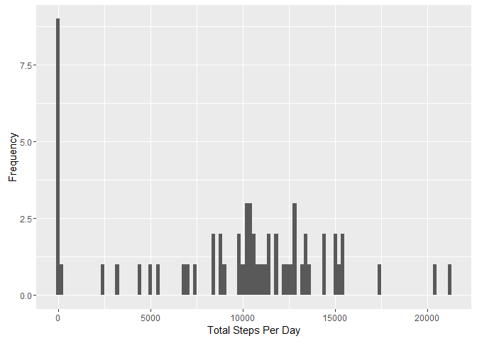
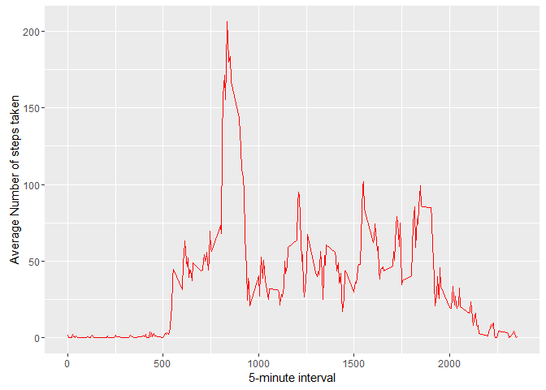
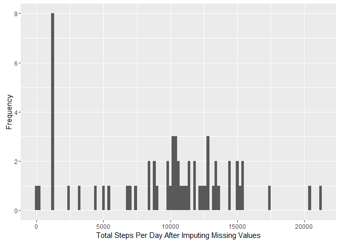
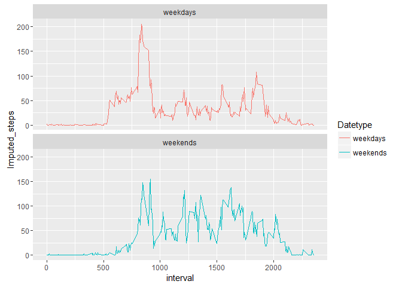

# Coursera_Reproducible_Research_Assignment1
Nitish  
December 27, 2016  
Introduction :- This assignment makes use of data from a personal activity monitoring device. This device collects data at 5 minute intervals through out the day. The data consists of two months of data from an anonymous individual collected during the months of October and November, 2012 and include the number of steps taken in 5 minute intervals each day.

Various questions asked in the assignemnet have been answered through the help of embedded 'r' code in this R Markdown which can be processed by knitr into HTML file.


Code for reading in the dataset and/or processing the data

```r
Read_ActivityData <- read.csv('activity.csv')
```
Calculate the total number of steps taken per day

```r
TotalStepsPerDay <- tapply(Read_ActivityData$steps, Read_ActivityData$date, sum, na.rm = TRUE)
TotalStepsPerDay
```

```
## 2012-10-01 2012-10-02 2012-10-03 2012-10-04 2012-10-05 2012-10-06 
##          0        126      11352      12116      13294      15420 
## 2012-10-07 2012-10-08 2012-10-09 2012-10-10 2012-10-11 2012-10-12 
##      11015          0      12811       9900      10304      17382 
## 2012-10-13 2012-10-14 2012-10-15 2012-10-16 2012-10-17 2012-10-18 
##      12426      15098      10139      15084      13452      10056 
## 2012-10-19 2012-10-20 2012-10-21 2012-10-22 2012-10-23 2012-10-24 
##      11829      10395       8821      13460       8918       8355 
## 2012-10-25 2012-10-26 2012-10-27 2012-10-28 2012-10-29 2012-10-30 
##       2492       6778      10119      11458       5018       9819 
## 2012-10-31 2012-11-01 2012-11-02 2012-11-03 2012-11-04 2012-11-05 
##      15414          0      10600      10571          0      10439 
## 2012-11-06 2012-11-07 2012-11-08 2012-11-09 2012-11-10 2012-11-11 
##       8334      12883       3219          0          0      12608 
## 2012-11-12 2012-11-13 2012-11-14 2012-11-15 2012-11-16 2012-11-17 
##      10765       7336          0         41       5441      14339 
## 2012-11-18 2012-11-19 2012-11-20 2012-11-21 2012-11-22 2012-11-23 
##      15110       8841       4472      12787      20427      21194 
## 2012-11-24 2012-11-25 2012-11-26 2012-11-27 2012-11-28 2012-11-29 
##      14478      11834      11162      13646      10183       7047 
## 2012-11-30 
##          0
```
Histogram of the total number of steps taken each day 

```r
library(ggplot2)
#binwidth set to 200
qplot(TotalStepsPerDay, xlab='Total Steps Per Day', ylab = 'Frequency', binwidth = 200)
```

<!-- -->

Mean and median number of steps taken each day

```r
Mean_TotalStepsPerDay <- mean(TotalStepsPerDay, na.rm = TRUE)
Median_TotalStepsPerDay <- median(TotalStepsPerDay, na.rm = TRUE)
Mean_TotalStepsPerDay
```

```
## [1] 9354.23
```

```r
Median_TotalStepsPerDay
```

```
## [1] 10395
```

```r
#To be reported :-
#Mean of Total Steps Per Day is 9354.23
#Median of Total Steps Per Day is 10395
```

Time series plot of the average number of steps taken

```r
#Part1
library(dplyr)
```

```
## 
## Attaching package: 'dplyr'
```

```
## The following objects are masked from 'package:stats':
## 
##     filter, lag
```

```
## The following objects are masked from 'package:base':
## 
##     intersect, setdiff, setequal, union
```

```r
interval <- Read_ActivityData %>%
  filter(!is.na(steps)) %>%
  group_by(interval) %>%
  summarize(steps = mean(steps))

ggplot(interval, aes(x=interval, y=steps)) + geom_line(color = "red") + xlab("5-minute interval") + ylab("Average Number of steps taken")
```

<!-- -->
 
The 5-minute interval that, on average, contains the maximum number of steps 

```r
interval[which.max(interval$steps),]
```

```
## Source: local data frame [1 x 2]
## 
##   interval    steps
##      <int>    <dbl>
## 1      835 206.1698
```
 

Report the total number of missing values in the dataset (i.e. the total number of rows with NAs)

```r
sum(is.na(Read_ActivityData$steps))
```

```
## [1] 2304
```
Code to describe and show a strategy for imputing missing data and creating new dataset where missing values has been imputed

```r
Data1 <- Read_ActivityData
Temp1 <- is.na(Data1$steps)
Median_interval <- tapply(Data1$steps, Data1$interval, median, na.rm=TRUE, simplify=TRUE)
Data1$steps[Temp1] <- Median_interval[as.character(Data1$interval[Temp1])]
```

Checking for absence of missing values

```r
sum(is.na(Data1$steps))
```

```
## [1] 0
```

Histogram of the total number of steps taken each day after missing values are imputed


```r
New_TotalStepsPerDay <- tapply(Data1$steps, Data1$date, sum)

library(ggplot2)
#binwidth set to 200
qplot(New_TotalStepsPerDay, xlab='Total Steps Per Day After Imputing Missing Values', ylab = 'Frequency', binwidth = 200)
```

<!-- -->

Calculate and report the mean and median total number of steps taken per day

```r
Mean_New_TotalStepsPerDay <- mean(New_TotalStepsPerDay, na.rm = TRUE)
Median_New_TotalStepsPerDay <- median(New_TotalStepsPerDay, na.rm = TRUE)
Mean_New_TotalStepsPerDay
```

```
## [1] 9503.869
```

```r
Median_New_TotalStepsPerDay
```

```
## [1] 10395
```

Impact of imputing missing values with median is Mean changes but Median remains same

Create a new factor variable in the dataset with two levels - "weekday" and "weekend" indicating whether a given date is a weekday or weekend day


```r
library(lubridate)
```

```
## 
## Attaching package: 'lubridate'
```

```
## The following object is masked from 'package:base':
## 
##     date
```

```r
Data1$date <- ymd(Data1$date)
Data1 <- mutate(Data1, Datetype = ifelse(weekdays(Data1$date) == "Saturday" | weekdays(Data1$date) == "Sunday", "weekends", "weekdays"))
Data1$Datetype <- as.factor(Data1$Datetype)
head(Data1)
```

```
##   steps       date interval Datetype
## 1     0 2012-10-01        0 weekdays
## 2     0 2012-10-01        5 weekdays
## 3     0 2012-10-01       10 weekdays
## 4     0 2012-10-01       15 weekdays
## 5     0 2012-10-01       20 weekdays
## 6     0 2012-10-01       25 weekdays
```

Panel plot comparing the average number of steps taken per 5-minute interval across weekdays and weekends

```r
Interval1 <- Data1 %>%
  group_by(interval, Datetype) %>%
  summarise(Imputed_steps = mean(steps))


g <- ggplot(Interval1, aes(x=interval, y=Imputed_steps, color = Datetype)) + 
geom_line() + facet_wrap(~Datetype, ncol = 1, nrow=2)
print(g)
```

<!-- -->


